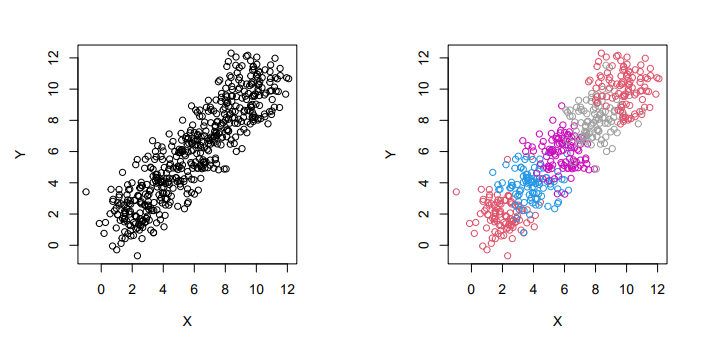
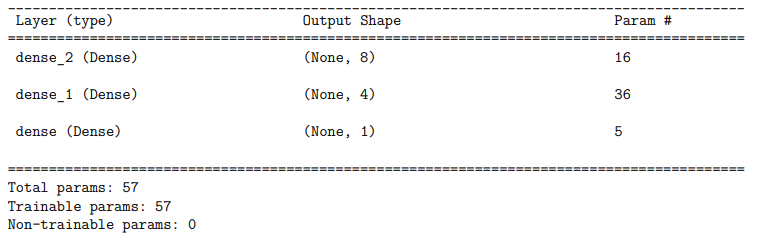
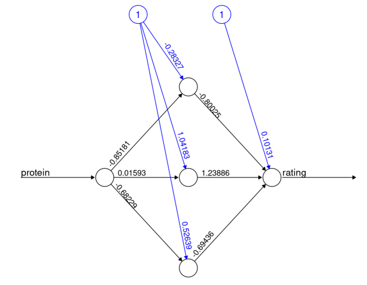
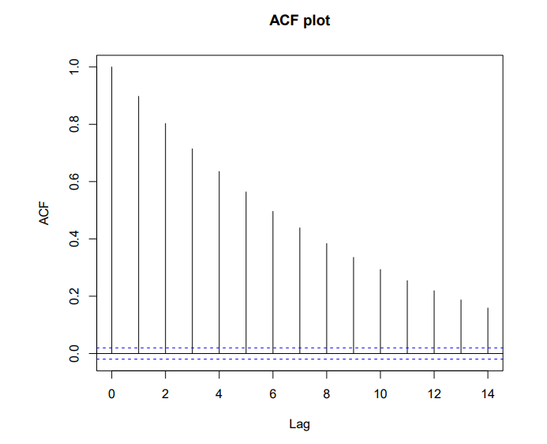

# Applied Stats Model II - Exam Two STAT 4520/7520 - Exam 2

## 1. (7 points) Consider the two plots below, which show the exact same (x, y) data. The difference is that the right plot has colored points based on a grouping variable. Is there a relationship between x and y? If not, how can we explain the left plot? Finally, how would you model the response y?



No relationship between X and Y if I control for the grouping variable. 
Within each group, x and y has no relationship. 

I will build a model of Y = X + four dummy variables (5-1 categories). 


## 2. (3 points) Say we have a fitted ARMA(p,q) model given by$Y_t = .3Y_{t−1} + ε_t$ What are the values of p and q?

p is 1
q is 0

## 3. Say we observe 100 events in a 20ft × 10ft spatial field under a homogeneous Poisson process:

• (4 points) What is the estimate of λ?

$\lambda$ is 100 or the average events 

• (3 points) If we considered a 100ft × 100ft region, how many events
would we expect?

```{r}
100 * 100 / (20 * 10)
```
Since the size is 50 times larger and is a homogeneous poisson process, we will expect 50 * 100 = 5000 events.


## 4. (6 points) Suppose we are measuring some response variable and our data contains 5 locations. How would our research goals be different if we considered the location factor as fixed vs random?

The location is considered fixed if we are interested in the specific 5 locations' effect. 

The location is considered as random if we are NOT interested in their specific effect. We consider the five locations as a random sample of n locations. 


## 5. (7 points) Using the below keras code and summary output, justify the number of parameters at each layer of the neural network.

```{r}
library(keras)
model <- keras_model_sequential() |>
layer_dense(units=8, activation= "relu", input_shape=1) |>
layer_dense(units=4, activation= "relu") |>
layer_dense(units=1, activation= "linear")
model |> summary()

```



There are units with bias for each layers.Thus,
First layer: 1 input (input_Shape =1) with one bias for each hidden unit. 2 * 8 = 16 parameters. 
Second layer: 8 units + 1 bias unit = 9 input units for each hidden unit (4 hidden units in the layer).  9 * 4 = 36 parameters. 
Third layer: 4 units + 1 bias unit = 5 input units for each final output unit (1 output unit. 5*1 = 5 parameters. 


## 6. Consider the below ANN which was fit to predict a cereal's rating based on its protein content. Using the provided weights and biases with an input of protein=4, find:

a. (6 points) The output value of each of the 3 neurons in the hidden layer assuming sigmoid activations.


```{r}
x = 4
y_Sigmoid <- function(x) 1/(1 + exp(-x))
h1 <- y_Sigmoid((-0.85181)*x + (-0.28327))
h2 <- y_Sigmoid((0.01593)*x + (1.04183))
h3 <- y_Sigmoid((-0.68229)*x + (0.52639))
print(h1)
print(h2)
print(h3)
```
The output values are the above.

b. (3 points) The output rating value assuming a linear activation. Be sure to show your calculatons (feel free to use R)

```{r}
# linear is identity?
y_identity <- function(x) x
o1 <- y_identity((-0.80025)*0.02435147 + (1.23886)*0.7512986 + (-0.69436)*0.09950202  + (0.10131))
o1
```
The output rating value is 0.9434863


## 7. (7 points) Consider the following ACF plot.

Which of the following models is more likely to have generated this
plot? Explain why. 

Model A: $Y_t = 0.9Y_{t−1} + ε_t$

Model B: $Y_t = −0.9Y_{t−1} + ε_t$



Model A is more likely, as the dependency gets weaker. 


## 8. (5 points) The file 1dConvolutionData.csv contains a collection of 100 sequential points. Read them into R and convolve them with the kernal c(0.054, 0.242, 0.389, 0.242, 0.054). Place the orginal signal as well as the output from the convolution on the same plot(be sure to line them up properly). What did this kernal do?


```{r}
#S4 - what does it mean to trim. how does the code work with kernal? purpose of kernal? can't we observe it already without it? not as obvious? large larger reverse is log?
cnn_data <- read.csv("E:/Cloud/OneDrive - University of Missouri/Mizzou_PhD/Class plan/Applied Stats Model II/Exam 2/1dConvolutionData.csv", stringsAsFactors = TRUE)
 
```

```{r}
input <- cnn_data$x 
kernal <- c(0.054, 0.242, 0.389, 0.242, 0.054)
output <- NULL
for(i in 2:(length(input)-1)){
value <- sum(input[(i-1):(i+1)]*kernal)
output <- c(output, value)
}
print(output)

```
```{r}
#plot(cnn_data$x[2:99],output,type="hist",col= c("blue","red"))
par(mfrow = c(1,2))
hist(output)
hist(cnn_data$x[2:99])

```


The kernal help me find the peak. since the middle points are larger than the surrounding points. 


## 9. Time series (20 points)

An AR(1) model with φ = 1 is often referred to as a random walk model.

```{r}
#??? AR(1) vs. theta = 1, S17
```


### a. (3 points) Write the model for Yt mathematically and explain the intuition behind this naming convention. 

$Y_t = Y_{t−1} + ε_t$

next period is the same distribution and independent from the previous period plus some random error. It is like walk in a random direction.

### b. (6 points) Using a random error process of ε ∼ N(0, 1), start a random walk from $Y_1 = 0$ and continue for 1000 steps. Plot the time series. 

```{r}
set.seed(1); n <- 1000; eps_t <- rnorm(n, sd = 1)
Y1 <- Y2 <- Y3 <- double(n)
Y1[1] <- Y2[1] <- Y3[1] <- 0
# Y_t = phi * Y_(t-1) + eps_t
for(i in 2:n) Y1[i] <- 1 * Y1[i-1] + eps_t[i]
plot.ts(Y1,ylim = c(-100,100));
abline(h=0,lty=2)

```


```{r}
#S24 dependent ppt ??? how to set it as AR(1)? theta?
#set.seed(1); n <- 1000; eps_t <- rnorm(n, sd = 1); par(mfrow=c(1,1))
#AR <- MA <- ARMA <- double(n)
#AR[1:2] <- MA[1:2] <- ARMA[1:2] <- 0
#for(i in 3:n) AR[i] <- sum(c(.6, .2) * AR[(i-1):(i-2)]) + eps_t[i]
```


### c. (6 points) Provide both an autocorrelation plot as well as a partial autocorrelation plot. Explain why they are so different. 

```{r}
#S12 ??? why non-constant variance?
#S18 
lm_Y1 <- lm( Y1 ~ I(1:n))

```

```{r}
par(mfrow = c(1,2))
acf(resid(lm_Y1))
pacf(resid(lm_Y1))
```

Partial ACF takes out the general autocorrelation trend while ACF does not (i.e., preseve all the autocorrleation).

### d. (5 points) Change the value of φ
to be something larger than 1 and generate another time series. Plot the
result and on comment on what you observe. Why does the AR(1) model have
the restriction that |φ| < 1?

```{r}
set.seed(1); n <- 1000; eps_t <- rnorm(n, sd = 1)
Y1 <- Y2 <- Y3 <- double(n)
Y1[1] <- Y2[1] <- Y3[1] <- 0
# Y_t = phi * Y_(t-1) + eps_t
for(i in 2:n) Y2[i] <- 1.2 * Y2[i-1] + eps_t[i]
plot.ts(Y2,ylim = c(-100,100));
abline(h=0,lty=2)
```
The model explodes. The Y2 goes to infinite. 
AR(1) must have the restriction to keep it from exploding.


## 10. Open Ended Analysis in R (29 points)

The data given in salamanders.csv contains counts of salamanders with
site and sampling covariates. Each of 23 sites was sampled 4 times. The
variables are as follows: • site: name of a location where repeated
samples were taken • mined: factor indicating whether the site was
affected by mountain top removal coal mining • sample: repeated sample •
spp: abbreviated species name, possibly also life stage • count: number
of salamanders observed We are primarily interested if mining is playing
an impact on the counts of salamanders, and also if this effect depends
on the species of salamander. 
```{r}
salamanders <- read.csv("E:/Cloud/OneDrive - University of Missouri/Mizzou_PhD/Class plan/Applied Stats Model II/Exam 2/salamanders.csv", stringsAsFactors = TRUE)
```


a. (4 points) Examine the distribution of
the response. Comment on what you observe and how it will effect your
analysis. 

```{r}
hist(salamanders$count)
```
Based on the histogram, there are many 0s. When there are too many 0s, there could be two distributions. The first is a hurdle from 0 to non-zero. Then the second distribution could be for non-zero responses.

b. Fit a mixed model to the data. You are free to choose how
to conduct the analysis. Please specifically list the following choices
along with a justification. 


• (4 points) R package (lme4, MCMCglmm,
glmmTMB, etc) 

I will use glmmTMB as it has the flexibity of fitting zero inflated and hurdle model for negative bionomial with random and fixed effects.


• (5 points) Response distribution. 

To model the count data with many 0s, I will use zero-inflated negative bionomial regression. 

• (7 points) Model
structure (fixed and random effects, etc) 

```{r}
#??? does the fixed effect also need to be nested? vs. fixed effect analysis?
```

Site is random effect since I am not interested in the specific location. There could be more locations to be sampled. 
The species are fixed effect since I am interested in the specific type's impact on the count. 

c. (6 points) Conduct an
analysis of your fixed effects and comment on how it answers the
questions of interest. 


```{r}
library(glmmTMB)
sal_glmm_zi <- glmmTMB(count ~ 1  + mined*spp + (1|site),
ziformula=~1,family=nbinom2(link = "log"),
data=salamanders)

#??? S26 GLMMs - why set parameter = ~1, ~0, 
#??? S35 GLMMs count data. how are these diff? glmmTMB, zeroinfl. what's the scale? log?
#??? S46 Randomeffect -> class nested in school? math, english why? or unique class?
```
```{r}
summary(sal_glmm_zi)
```

The fixed effect analysis show that:
Mining has a negative and significant simple effect on the number of salamanders (-2.22), p < 0.01. 
Mining's effect depends on the specie. The GP specie has a negative interaction with the mining. When there is minig, the GP specie's count decrease is much higher (-1.93), p<0.05


d. (3 points) Create one or more diagnostic plots
and comment.

```{r}
qqnorm(residuals(sal_glmm_zi),main="QQ plot of Residuals")
qqline(residuals(sal_glmm_zi))

```
The model doesn't fit well as the two ends deviate from the normal line. 

```{r}
#??? how to fix? is it the outlier?
#??? how to interpret? S50 random effect ppt
plot(fitted(sal_glmm_zi),residuals(sal_glmm_zi),xlab="Fitted",ylab="Residuals",main="Residuals vs Fitted")
abline(h=0)

```

```{r}
#qqnorm(ranef(sal_glmm_zi)$site[[1]],main="site Effects")
#qqline(ranef(sal_glmm_zi)$site[[1]])
```
